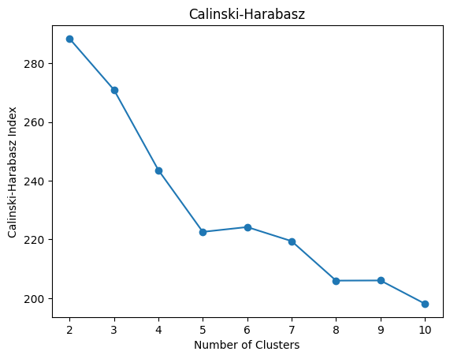

# Portafolio

Este portafolio presenta una selección de proyectos que ilustran estas habilidades y más. Cada uno es un testimonio de mi capacidad para manipular, analizar y traducir datos en insights útiles y accionables.

Agradezco tu interés y te invito a explorar más. ¡Gracias por visitar!

## Proyectos de Ciencia de Datos

 **[Clustering on discrete attributes and cluster characterization](https://github.com/xavierjacomep/Machine-Learning-Templates/blob/main/Unsupervised-Learning/Clustering/Clustering_on_discrete_attributes_and_cluster_characterization.ipynb)**

Multiple Correspondence Analysis is used to create components from categorical features and then KMeans is applied to determine clusters. The Calinski-Harabasz index and the Elbow method are applied to determine the optimal number of clusters. The Test Value is used to characterize the clusters. 

___

 **[Test Value Criterion for group characterization (Criterio Test de Valor para caracterización de grupos)](https://github.com/xavierjacomep/TestValue-GroupCharacterization)**

EN: Test Vaue Criterion is mainly used for the characterization of a group of observations according a variable, continuous or categorical. ESP: El Test de Valor se utiliza principalmente para la caracterización de un grupo de observaciones según una variable, continua o categórica.

___

 **[Análisis Geoespacial con Geohash](https://github.com/xavierjacomep/Geohash_Spatial_Analysis)**

Análisis geoespacial que utiliza Geohash, un sistema de geocodificación de dominio público, para simplificar y acelerar las operaciones espaciales, como la clasificación y búsqueda. El caso de uso que se explora en este proyecto se basa en las geometrías de las unidades educativas en Guayaquil. 

___

 **[Análisis Crediticio implementando Optimal Binning con Python](https://github.com/xavierjacomep/CreditScoringSEE/)**

Jupyter Notebook con la resolución del proyecto final del curso de Credit Scoring con Python de la Sociedad Ecuatoriana de Estadística. En este curso se implementó Scorecard de la librería optbinning como una opción para crear calificaciones crediticias utilizando modelos bases de machine learning.

___

 **[Ecuador's top cities and their point of interests parish segmentation characteristics](https://github.com/xavierjacomep/IBM_Capstone_POIs_Clustering/)**

Jupyter Notebook en el cual se analizó las dos principales ciudades de Ecuador y cómo se segmentan geográficamente en función de los puntos de interés que abarcan su territorio; se invoca al API places de Foursquare y se aplica la técnica de clustering KMeans.

___

## Proyectos de Visualización de Datos

 **[Análisis de Churn Telco](https://www.novypro.com/project/an%C3%A1lisis-de-churn-power-bi)**

Este tablero interactivo ofrece una representación clara y concisa de los patrones de abandono de clientes, brindando a las empresas una visión profunda de los factores que contribuyen al churn. Mediante el uso de técnicas avanzadas de visualización y análisis de datos, he proporcionado una solución efectiva para ayudar a las empresas a retener y fidelizar a sus clientes de manera estratégica.

___

 **[Análisis de Reportes de incendios de Boston](https://public.tableau.com/views/BostonFireIncidentReporting/BostonFireIncidentReporting?:language=en-US&:display_count=n&:origin=viz_share_link)**

Análisis de incidentes por día y hora, destacándose los principales barrios donde ocurrieron y cuáles fueron los principales tipos de incidentes reportados.
 
 

___

## Micro Proyectos
- ### Análisis Geoespacial
    - [Análisis de Precisión de Geohash](https://github.com/xavierjacomep/Geohash_Precision_Analysis) : Este repositorio contiene un Jupyter Notebook que explora la precisión de los códigos Geohash y cómo se correlaciona con las dimensiones físicas en la Tierra.

- ### Análisis de Recursos Máquina
    - [Información de recursos de CPU y GPU](https://github.com/xavierjacomep/System_Resource_Profiler) : Este script Python tiene el propósito de ofrecer un desglose rápido y completo de las características y recursos disponibles de la CPU y GPU en tu máquina.

___

